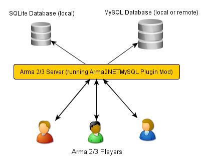

Arma2NETMySQLPlugin's documentation
===============================================

===============================================
Introduction
===============================================

Links:

* `Arma2NETMySQLPlugin Github Page`_
* `Arma2NETMySQLPlugin BIS Forums Thread`_
* `Arma 2 Example Mission`_
* `Arma 3 Example Mission`_

.. _Arma2NETMySQLPlugin Github Page: https://github.com/firefly2442/Arma2NETMySQLPlugin
.. _Arma2NETMySQLPlugin BIS Forums Thread: http://forums.bistudio.com/showthread.php?128795-Arma2MySQL
.. _Arma 2 Example Mission: https://github.com/firefly2442/Arma2NetMySQLPlugin-ExampleMission
.. _Arma 3 Example Mission: https://github.com/firefly2442/Arma2NetMySQLPlugin-Arma3-ExampleMission

This plugin acts as an intermediary between Arma2/Arma3 and a `MySQL`_ or `SQLite`_ database.
It uses the `Arma2NET`_ wrapper system.  It is written in C#.  The program has to be run on the
same system as your Arma2/Arma3 server, however, the MySQL database can be either local or remote.
The SQLite database runs on the local machine.

Please read this entire document as it
has many important details regarding the installation and setup.

.. _Arma2NET: http://dev.withsix.com/projects/a2n
.. _MySQL: http://www.mysql.com
.. _SQLite: http://www.sqlite.org

-----------------------------------------------
History
-----------------------------------------------

This program has had a long history.  Initially, the program used `JayArma2Lib`_ because DLL injections were the only way to
pass information between Arma2 and the outside.  Eventually, BIS added `CallExtension`_
which allows for a more structured (non-hacky) way to pass information.  JayArma2Lib switched to using CallExtension and things continued.
Development of a program that used JayArma2Lib to connect to MySQL was `done here`_ and an `example mission`_ was
created.

Technically, all that code should still work but the bad part was all the formatting and ugly stuff that had to be done in game via
SQF scripting in order to get the data into a reasonable format.  It involved iterating through strings and creating arrays and generally
was pretty hacky.

Then, `Arma2NET`_ came along and things got much easier.  This wrapper system allows us to
return nice results back to Arma2/Arma3 without having to deal with all the formatting nonsense.

The end result is a plugin for Arma2NET called Arma2NETMySQLPlugin.
Development of this plugin is done via `Github`_.

There are a wide variety of projects that currently use this plugin to save data.

* `Persistent Database Scripts`_ (not currently maintained or updated) created by `[KH]JMan`_ and others
* `MSO`_ (modular mission framework)
* `Altis Life RPG`_

Arma2NET and this plugin are only required on your Arma2/Arma3 server.  They are
not needed client-side.

.. _CallExtension: http://community.bistudio.com/wiki/callExtension
.. _done here: http://dev.withsix.com/projects/arma2-mysql
.. _example mission: http://dev.withsix.com/projects/arma2mysql-example
.. _Github: http://www.github.com
.. _Persistent Database Scripts: http://forums.bistudio.com/showthread.php?111484-ArmA2-Persistent-Database-Scripts-WIP
.. _[KH]JMan: http://forums.bistudio.com/member.php?30502-KH-Jman
.. _MSO: http://dev.withsix.com/projects/mso/wiki
.. _Altis Life RPG: http://forums.bistudio.com/showthread.php?168139-Altis-Life-RPG
.. _JayArma2Lib: http://dev.withsix.com/projects/jayarma2lib

===============================================
Requirements
===============================================

To run the plugin:

* You need a Windows server. (see `Known Issues`)
* One of the following:

	* A `MySQL`_ server and database setup
	* A `SQLite`_ database setup

* Install **both** of the following dependencies (even if you are only using MySQL or SQLite individually):

.. warning:: If you are using a precompiled version of this plugin, you will need to use the specific version of the connectors
   for MySQL and SQLite listed below.  The precompiled version of the plugin **will not work with any other version**.
   I will attempt to keep the precompiled version relatively up-to-date.  Alternatively,
   you can compile the plugin yourself on Windows if you have Visual Studio.  See the section
   `For Developers` for more details on this.

* `MySQL Connector for .NET`_

.. note:: Successfully tested with version 6.7.4 (mysql-connector-net-6.7.4.msi)

* `Precompiled Binaries of SQLite for 32-bit Windows (.NET Framework 4.0)`_

.. note:: Successfully tested with version 1.0.89.0 (sqlite-netFx40-setup-bundle-x86-2010-1.0.89.0.exe)

* `Microsoft .NET Framework 4 Client Profile`_

* Arma 2 or Arma 3

	* Arma2OA Beta version 87640 or later (full client or dedicated server)

		* See `the following ticket`_ for a note about Windows dedicated servers and required files.  I would recommend running whatever `Arma 2 beta version`_ is the latest.

	* Arma 3 (all versions supported)

* `Arma2NET`_, this should already be included if you downloaded a compiled version of this plugin.

.. _Arma2NET: http://dev.withsix.com/projects/a2n
.. _MySQL: http://www.mysql.com
.. _SQLite: http://www.sqlite.org
.. _MySQL Connector for .NET: http://www.mysql.com/downloads/connector/net/
.. _Precompiled Binaries of SQLite for 32-bit Windows (.NET Framework 4.0): http://system.data.sqlite.org/index.html/doc/trunk/www/downloads.wiki
.. _Microsoft .NET Framework 4 Client Profile: http://www.microsoft.com/download/en/details.aspx?id=24872
.. _the following ticket: http://dev.withsix.com/issues/31028
.. _Arma 2 beta version: http://www.arma2.com/beta-patch.php

===============================================
Installation and Setup
===============================================

-----------------------------------------------
Copy Files and Setup Folder Structure
-----------------------------------------------

Arma2NETMySQL looks two places for the relevant files and folders.  First, it checks the Arma2/Arma3 root directory.  If it can't find
them there, it looks in the AppData folder.  I would recommend using the AppData location if possible because of a possible
security issue with the Databases.config file.  This also makes future upgrades
and changes easier to manage.  However, some people on limited rental servers may need to put them in the root Arma2/Arma3 folder.
Make sure the file/folder structure matches one of these.

.. warning:: If you're running a rental server and don't have access to the AppData folder, there is a possible security
	hole with having your Databases.config file in the root directory.  Malicious users could use `loadFile`_ to read
	your Databases.config file.  Given this, they would have access to your database username and password.  To prevent this,
	use the `server.cfg`_ `allowedLoadFileExtensions` variable and make sure the .config file extension is removed.

.. _loadFile: https://community.bistudio.com/wiki/loadFile
.. _server.cfg: https://community.bistudio.com/wiki/server.cfg#Server_Security

.. warning:: Don't put some files in one location and some in the other, that could result in problems.

This is just an example location for Arma 2, you'll have to figure out where your Arma2/Arma3 game folder is.

.. code-block:: html

	E:\Program Files\Steam\steamapps\common\arma 2 operation arrowhead\
	E:\Program Files\Steam\steamapps\common\arma 2 operation arrowhead\Databases.config
	E:\Program Files\Steam\steamapps\common\arma 2 operation arrowhead\sqlite\
	E:\Program Files\Steam\steamapps\common\arma 2 operation arrowhead\logs\

.. code-block:: html

	C:\Users\Yourname\AppData\Local\Arma2NETMySQL\
	C:\Users\Yourname\AppData\Local\Arma2NETMySQL\Databases.config
	C:\Users\Yourname\AppData\Local\Arma2NETMySQL\sqlite\
	C:\Users\Yourname\AppData\Local\Arma2NETMySQL\logs\

This location is for Windows 7/Vista.  If you're running an older version of Windows, this location will probably be different.

The folder structure for Arma2NET should look like the following.  Note that if you downloaded a compiled version of the plugin,
this should already be included and setup correctly.

This is just an example location for Arma 2, you'll have to figure out where your Arma2/Arma3 game folder is.

.. code-block:: html

		E:\Program Files\Steam\steamapps\common\arma 2 operation arrowhead\@Arma2NET\
		E:\Program Files\Steam\steamapps\common\arma 2 operation arrowhead\@Arma2NET\Addins\
		E:\Program Files\Steam\steamapps\common\arma 2 operation arrowhead\@Arma2NET\AddIns\Arma2NETMySQLPlugin\
		E:\Program Files\Steam\steamapps\common\arma 2 operation arrowhead\@Arma2NET\AddIns\Arma2NETMySQLPlugin\Arma2NETMySQLPlugin.dll
		E:\Program Files\Steam\steamapps\common\arma 2 operation arrowhead\@Arma2NET\AddIns\Arma2NETMySQLPlugin\MySql.Data.dll
		E:\Program Files\Steam\steamapps\common\arma 2 operation arrowhead\@Arma2NET\AddIns\Arma2NETMySQLPlugin\System.Data.SQLite.dll

-----------------------------------------------
Setup the Databases.config File
-----------------------------------------------

Edit the Databases.config file. This file requires separate lines for each database (even if they're on the same host).
Any line that starts with a pound/hash sign "#" is considered a comment.

.. warning:: This database text file stores usernames and passwords in plaintext.  **Be very careful about who has access to this!**  In addition,
	Arma2NETMySQL does not limit the actions that can be performed on the database.  For security reasons, create a username that is locked down
	and only has access to a single database.  **Connecting to the database as the root user is flagged and NOT allowed through the plugin.**
	This is generally a really bad choice because this user has full access.
	**We will not be responsible if something gets deleted!**  Please note that there
	are no checks for `SQL injection`_ attacks so be extremely
	careful about how you allow users to input information that will run against the database.
	
Put the Databases.config file in the appropriate location given the folder structure
that you decided on above.

.. _SQL injection: https://en.wikipedia.org/wiki/SQL_injection

-----------------------------------------------
Setup @Arma2NET Mod
-----------------------------------------------

Next you will need to setup @Arma2NET as a mod and start Arma2/Arma3.  Simply add the mod
when you start the game.
For example your command line parameters (for the server which connects to the database) might look like this:

.. code-block:: python
	:linenos:

	-mod=expansion\beta;expansion\beta\expansion;@Arma2NET

See the `Arma 2 startup parameters`_ or `Arma 3 startup parameters`_ pages for more details.

This plugin doesn't require any other third party mods like ACE or CBA.  But, they do have some nice utility functions
and features that may be helpful when you make your missions.

Arma2/Arma3 player clients do not need to do any of this.  This plugin runs serverside.
The players will interact with the Arma2/Arma3 server.  Through SQF scripting
the information is passed from the database back to the players.  This makes
it easy on the players because there are no special mods that they need to install.

.. _Arma 2 startup parameters: http://community.bistudio.com/wiki/Arma2:_Startup_Parameters
.. _Arma 3 startup parameters: http://community.bistudio.com/wiki/Arma3:_Startup_Parameters

===============================================
Using the Plugin
===============================================

-----------------------------------------------
Connecting to MySQL
-----------------------------------------------

There are two ways to run MySQL queries with this plugin.  One is using MySQL stored procedures and the other
is just to use straight SQL queries.

^^^^^^^^^^^^^^^^^^^^^^^^^^^^^^^^^^^^^^^^^^^^^^^
MySQL Stored Procedures
^^^^^^^^^^^^^^^^^^^^^^^^^^^^^^^^^^^^^^^^^^^^^^^

Setup a MySQL database and create some stored procedures to use.  For information regarding permissions required
to create and execute stored procedures, see this `MySQL guide`_.

MySQL stored procedures are essentially just stored commands that run.  If you know basic SQL commands (SELECT, 
INSERT, UPDATE, etc.) you should be fine.  These stored procedures can optionally have parameters that are passed which
can then be used in the procedure.

There are a wide variety of tutorials regarding MySQL stored procedures but the best one I've found so far with nice
examples are these:

* `Getting Started With Stored Procedures`_
* `Stored Procedure Parameters`_

The related tutorials links on the bottom of the page are also in the same series.

Your SQF code will look something like this:

.. code-block:: python
	:linenos:

	_strCreate = format ["[u=%1,n=%2,a=%3,b=%4,c=%5,d=%6,e=%7]", _allWeapons select 0, _loadoutName, _allWeapons select 1,
	_allWeapons select 2, _allWeapons select 3, 
	_allWeapons select 4, _allWeapons select 5];

	_create = "Arma2Net.Unmanaged" callExtension format ["Arma2NETMySQL ['weapons', 'CreateNewLoadOut', '%1']", _strCreate];

In this example, "weapons" is the database name.  "CreateNewLoadOut" is the MySQL stored procedure.  The parameters
as part of the procedure are formatted and then passed along as the third argument.

.. _MySQL guide: https://dev.mysql.com/doc/refman/5.0/en/stored-routines-privileges.html
.. _Getting Started With Stored Procedures: http://www.mysqltutorial.org/getting-started-with-mysql-stored-procedures.aspx
.. _Stored Procedure Parameters: http://www.mysqltutorial.org/stored-procedures-parameters.aspx

^^^^^^^^^^^^^^^^^^^^^^^^^^^^^^^^^^^^^^^^^^^^^^^
Straight MySQL Queries
^^^^^^^^^^^^^^^^^^^^^^^^^^^^^^^^^^^^^^^^^^^^^^^

This is similar to what you're probably used to.  Commands like:

.. code-block:: python
	:linenos:

	SELECT * FROM table WHERE name = 'user'

There are two ways to run SQL queries.  The first way is a little simpler and easier on the SQF scripting side.
It uses the command Arma2NETMySQLCommand and will block until a result is returned.
The other way is to use the command Arma2NETMySQLCommandAsync which is better for servers that will heavily
utilize this plugin and have a significant number of players.  This will return null immediately upon calling it because
it's an asynchronous call.  You will then need to loop and continue calling it until you get the result back.  If you
are fairly proficient with SQF, I would recommend the second option.

* Arma2NETMySQLCommand

Your SQF code will look something like this:

.. code-block:: python
	:linenos:

	_selectTest = "Arma2Net.Unmanaged" callExtension "Arma2NETMySQLCommand ['weapons', 'SELECT * FROM users LIMIT 3']";

In this example, "weapons" is the database name.  The next portion is the entire SQL query which you will need
to create manually.  This will block until the database call is complete and the result is returned.

* Arma2NETMySQLCommandAsync

Your SQF code will look something like this:

.. code-block:: python
	:linenos:

	_selectTest = nil;
	while {isNil("_selectTest")} do {
		_selectTest = "Arma2Net.Unmanaged" callExtension "Arma2NETMySQLCommandAsync ['weapons', 'SELECT * FROM users LIMIT 3']";
		if (_selectTest == "") then {
			_selectTest = nil;
		};
		sleep 0.5;  //sleep for a half-second so we don't thrash the server with callExtension calls
	};

In this example, "weapons" is the database name.  The next portion is the entire SQL query which you will need
to create manually.  You will then need to loop until the result is returned.

-----------------------------------------------
Connecting to SQLite
-----------------------------------------------

There is one way to run SQLite queries with this plugin.

^^^^^^^^^^^^^^^^^^^^^^^^^^^^^^^^^^^^^^^^^^^^^^^
SQLite Database Setup
^^^^^^^^^^^^^^^^^^^^^^^^^^^^^^^^^^^^^^^^^^^^^^^

Databases need to be in your root Arma2/Arma3 folder or the appdata sqlite folder.  See the above notes
on `Installation and Setup` for details.

SQLite databases are just a single file that have .sqlite as a file ending.  This file
stores the database structure as well as the data.

Here is an example SQLite database location using appdata:

.. code-block:: html

	C:\Users\Yourname\AppData\Local\Arma2NETMySQL\sqlite\weapons.sqlite

Make sure your database name matches the name in the Databases.config file (minus the .sqlite ending).

If you need a client for creating and managing SQLite databases, there is a nice
`SQLite Firefox plugin`_ that works well.

.. _SQLite Firefox plugin: https://addons.mozilla.org/en-US/firefox/addon/sqlite-manager/

^^^^^^^^^^^^^^^^^^^^^^^^^^^^^^^^^^^^^^^^^^^^^^^
SQLite Queries
^^^^^^^^^^^^^^^^^^^^^^^^^^^^^^^^^^^^^^^^^^^^^^^

This is similar to what you're probably used to.  Commands like:

.. code-block:: python
	:linenos:

	SELECT * FROM table WHERE name = 'user'

There are two ways to run SQL queries.  The first way is a little simpler and easier on the SQF scripting side.
It uses the command Arma2NETMySQLCommand and will block until a result is returned.
The other way is to use the command Arma2NETMySQLCommandAsync which is better for servers that will heavily
utilize this plugin and have significant numbers of players.  This will return null immediately upon calling it because
it's an asynchronous call.  You will then need to loop and continue calling it until you get the result back.  If you
are fairly proficient with SQF, I would recommend the second option.

* Arma2NETMySQLCommand

Your SQF code will look something like this:

.. code-block:: python
	:linenos:

	_selectTest = "Arma2Net.Unmanaged" callExtension "Arma2NETMySQLCommand ['weapons', 'SELECT * FROM users LIMIT 3']";

In this example, "weapons" is the database name.  The next portion is the entire SQL query which you will need
to create manually.  This will block until the database call is complete and the result is returned.

* Arma2NETMySQLCommandAsync

Your SQF will look something like this:

.. code-block:: python
	:linenos:

	_selectTest = nil;
	while {isNil("_selectTest")} do {
		_selectTest = "Arma2Net.Unmanaged" callExtension "Arma2NETMySQLCommandAsync ['weapons', 'SELECT * FROM users LIMIT 3']";
		if (_selectTest == "") then {
			_selectTest = nil;
		};
		sleep 0.5;  //sleep for a half-second so we don't thrash the server with callExtension calls
	};

In this example, "weapons" is the database name.  The next portion is the entire SQL query which you will need
to create manually.  You will then need to loop until the result is returned.

---------------
Load a Mission
---------------

You can use the instructions listed above to create your own missions.  There are
two missions provided as examples, one for Arma2 and one for Arma3.  The example
mission has a simple crate and GUI interface for loading and saving weapon/kit
loadouts into a MySQL or SQLite database.  This is a good place to start if you are a mission
maker.

* `Arma 2 Example Mission`_
* `Arma 3 Example Mission`_

.. _Arma 2 Example Mission: https://github.com/firefly2442/Arma2NetMySQLPlugin-ExampleMission
.. _Arma 3 Example Mission: https://github.com/firefly2442/Arma2NetMySQLPlugin-Arma3-ExampleMission

===============================================
Known Issues
===============================================

.. note::

	Arma2NETMySQLPlugin uses the `CallExtension`_ function, however, there are some
	`technical considerations`_ as part of this.

	Returning results via callExtension in Arma 2 beta 97299 (or higher) or Arma 3 has a limit of 16383 (~16 KB) characters.  If you try to run a query
	that will return a result longer than 16383 characters,
	it will return the string "TooLong".  Then you know you will need to limit the number of results that are returned.
	You can use the `MySQL Limit parameter`_ and `SQLite Limit parameter`_ to limit
	the number of returned entries.

	This `CallExtension`_ limit is part of the Arma2/Arma3 game engine so I don't have any control
	over changing it.

.. note::

	Currently, commas cannot be used as data to be sent back and forth because the system uses commas to identify
	splitting up the database columns.  If you have a suggestion for how to solve this or would like to submit a fix, I would
	certainly appreciate it.

.. note::

	The `CallExtension`_ method will block on the server until
	a result is returned.  Some people were reporting problems when running this plugin on servers with lots of players and running
	many database calls.  This was lagging the server and causing players issues.

	If you are doing this and using Arma2NETMySQLCommand
	and need super high performance, consider switching over to the asynchronous
	method of using Arma2NETMySQLCommandAsync.  After switching to this, server administrators
	have reported running high numbers of queries with many players with significantly less lag.

.. _CallExtension: http://community.bistudio.com/wiki/callExtension
.. _technical considerations: http://community.bistudio.com/wiki/Extensions#A_few_technical_considerations
.. _MySQL Limit parameter: https://dev.mysql.com/doc/refman/5.0/en/select.html
.. _SQLite Limit parameter: https://www.sqlite.org/lang_select.html

===============================================
Troubleshooting
===============================================

Stuck?  First check the Arma2NETMySQL log files.

.. code-block:: html

	E:\Program Files\Steam\steamapps\common\arma 2 operation arrowhead\logs\
	C:\Users\Yourname\AppData\Local\Arma2NETMySQL\logs\

The plugin creates a new log file each time it's run.

If you don't have a logs folder or it's empty, this is a sign the plugin isn't running
and Arma2NET could not load it.

Arma2NET has log files here:

.. code-block:: html

	C:\Users\Yourname\AppData\Local\Arma2NET\

This will tell you if the plugin is loading appropriately.  If it's not, check your Arma2/Arma3
launcher and make sure that is all correct.

Lastly you can check the Arma2/Arma3 RPT log file.

.. code-block:: html

	C:\Users\Yourname\AppData\Local\{ArmA 2 OA\Arma 3}

These can get very long so scroll all the way to the bottom to see the latest run.  This will tell you if you have an error in
your SQF scripting code or other such problems.  Note, these path locations are for Windows 7 (and Vista?) and may be different
for other versions of Windows.

.. note::

	Windows 7 (and other Windows versions?) can sometimes block DLLs from running. If you right click the .dll and click on properties
	at the bottom of the list there is a security tab. For the precompiled DLL, it knows the DLL came from another computer and
	thus doesn't trust it.  You'll need to enable the DLL to run.  If you are not comfortable with this, you can always compile
	the source code and generate the DLL yourself.

.. note::

	**This is the most common problem that people have.**
	This plugin requires both the MySQL and SQLite C# connector libraries to be installed.  The plugin
	then references the appropriate .DLL files.  If you look in the log files and see something like
	"Fatal unhandled exception of type System.IO.FileNotFoundException" this means that it can't find
	one of the dependencies.  As mentioned above, make sure to install the specific version
	that this plugin was compiled against otherwise it won't work.

.. note::

	If you are getting a returned result of "Error" in the game, this probably means there's something wrong with your query.  Check
	the logs to track down the problem.

If you're still having problems, please go back and double check that you did everything correctly.  If you skipped a step
or got an error and just decided to continue to the next step, nothing will work.

If you found a bug in the plugin, please create an issue ticket on the `Github issues`_ page.

If you're still stuck, please post on the `Arma2NETMySQLPlugin BIS Forums Thread`_.
The forums are preferred over emailing me because the question and answer are available to
future people who have similar problems.  If you post any questions anywhere, please post **ALL**
log files, otherwise we will have problems helping you.

.. _Github issues: https://github.com/firefly2442/Arma2NETMySQLPlugin
.. _Arma2NETMySQLPlugin BIS Forums Thread: http://forums.bistudio.com/showthread.php?128795-Arma2MySQL

===============================================
For Developers
===============================================

To examine the sourcecode, open up the provided Visual Studio project.  To compile the code into a .DLL check to make sure
the references are pointing to the correct place.

MySql.Data needs to be listed in the references and should point to "MySql.Data.dll"
which is provided by the MySQL Connector listed above.  System.Data.SQLite should point to "System.Data.SQLite.dll" which is provided
by the SQLite precompiled binaries listed above.

Once these are set, you can compile the sourcecode.  The resulting .DLL should be placed
in the Arma2NET Addins folder here: @Arma2NET\AddIns\Arma2NETMySQLPlugin.  Each plugin is stored in a folder with the name of the DLL.
Any dependency DLLs can also be placed in this folder as well.

For easy testing, you can use Arma2NetExplorer.exe provided by Arma2NET.  After launching this program, click "list addins" to see
if Arma2NETMySQL loaded in correctly.  Then you can run straight commands as outlined in the above documentation.

For example:

.. code-block:: python
	:linenos:

	Arma2NETMySQLCommand ['weapons', 'SELECT * FROM users LIMIT 3']

If the Databases.config file and your database is setup correctly, you can run queries here and see the result.  This is
extremely helpful for testing without having to load up Arma2/Arma3.

Make sure if you make a change to the C# code that you recompile and copy
over the .DLL to the appropriate folder, otherwise you'll be running the old version and won't see any changes.

===============================================
Changelog
===============================================

* Version 1.0 beta

	* Currently in testing

===============================================
Translations
===============================================

All translations of this readme to other languages besides English are provided
by the community.  I take no responsibility for the accuracy of the translations.

**If you would like to contribute translations, I would really appreciate it!**

-----------------------------------------------
How To Contribute Translations
-----------------------------------------------

This readme uses the `Sphinx Documentation`_ system.  It uses a simple
markdown format.  Some of the translation strings have markdown inside
the string so make sure to keep that intact.

We use .po/.pot files and gettext for translating strings.

The easiest option is to do the translations right in your web browser.
You can join the `Poeditor`_ website and start right now.

The second option is to fork the project on the `Arma2NETMySQLPlugin Github Page`_ and use an editor for
the .po files and create the translations.

The .po files can be found here:

.. code-block:: html

	Arma2NETMySQLPlugin/documentation/source/locale/

The base .pot file can be found here:

.. code-block:: html

	Arma2NETMySQLPlugin/documentation/build/locale/index.pot

An excellent cross-platform
editor for .po files is `Poedit`_.  Then, submit a pull request and I
will merge them in.  See the `Poedit Wikipedia page`_ and `Gettext Wikipedia page`_
for more details.

If you have any questions about translations, please ask on the `Arma2NETMySQLPlugin BIS Forums Thread`_.

.. _Sphinx Documentation: http://sphinx-doc.org/
.. _Poedit: http://www.poedit.net/
.. _Poedit Wikipedia page: http://en.wikipedia.org/wiki/Poedit
.. _Gettext Wikipedia page: http://en.wikipedia.org/wiki/Gettext
.. _Poeditor: https://poeditor.com/join/project?hash=33b7975a5fe8327995ab0cd0c1056b31
.. _Arma2NETMySQLPlugin Github Page: https://github.com/firefly2442/Arma2NETMySQLPlugin
.. _Arma2NETMySQLPlugin BIS Forums Thread: http://forums.bistudio.com/showthread.php?128795-Arma2MySQL

===============================================
License
===============================================

Arma2NETMySQL is licensed under the GPL version 3 (see license.txt).

If you would like
to contribute code or fixes, please fork the project on Github
and submit a pull request.

===============================================
Thanks To
===============================================

* Scott_NZ for `Arma2NET`_
* Hatchet, Robalo, Buehgler and all the guys over at `AlphaSquad`_
* JMan at `Kellys Heroes`_
* All the testers
* All the translators
* `Bohemia Interactive`_

.. _Arma2NET: http://dev.withsix.com/projects/a2n
.. _AlphaSquad: http://www.alphasquad.net
.. _Kellys Heroes: http://www.kellys-heroes.eu
.. _Bohemia Interactive: http://www.bistudio.com

